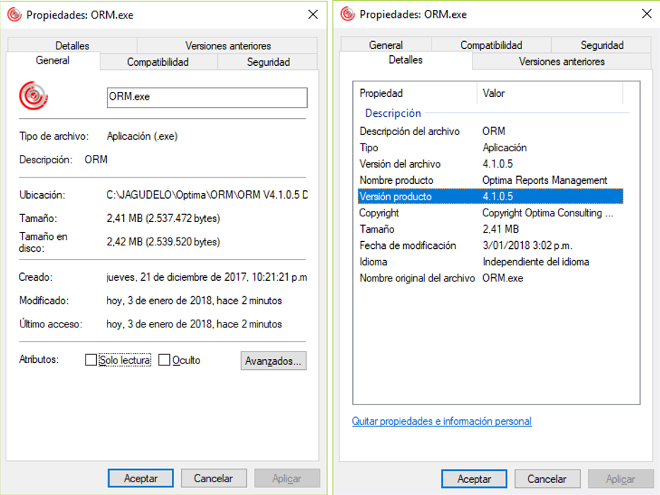
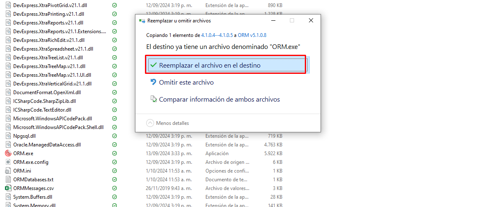

# Manual Funcional para la actualización de versiones ORM

# Introducción 
Para esta entrega se realiza un nuevo ejecutable, en este se arreglan dos bugs reportados anteriormente durante las pruebas realizadas.




# Instalar aplicación
Para realizar la aplicación de esta entrega se debe descargar el archivo .exe y reemplazarlo en la carpeta donde se tiene instalador el ORM, dejando solo el nuevo archivo.


Dar clic en reemplazar y se inicia el aplicativo con normalidad.


# Bugs corregidos en v4.1.0.5
Enero 3 2018 - Versión 4.1.0.5:   
•	Se ajusta manejo del nombre del archivo generado por tareas programadas, dado que si este nombre de archivo contenía uno o varios caracteres “.” la función de .NET que devuelve el nombre del archivo sin extensión solo tomaba hasta el primer punto y descartaba el resto del texto. Se incluye una mejora en el método que devuelve la variable Archivo de la forma frmEditTareaPost.cs para remplazar la línea:

 ```Path.GetFileNameWithoutExtension(txtArchivo.Text)```

 por:

    string nomArch = txtArchivo.Text;
    if (txtArchivo.Text.ToUpper().EndsWith(".XLS") || txtArchivo.Text.ToUpper().EndsWith(".XLSX") || txtArchivo.Text.ToUpper().EndsWith(".CSV") ||
                            txtArchivo.Text.ToUpper().EndsWith(".RTF") || txtArchivo.Text.ToUpper().EndsWith(".PDF") || txtArchivo.Text.ToUpper().EndsWith(".TXT") ||
                            txtArchivo.Text.ToUpper().EndsWith(".HTML") || txtArchivo.Text.ToUpper().EndsWith(".XML"))
    {
        int index = nomArch.LastIndexOf('.');
        nomArch = index == -1 ? nomArch : nomArch.Substring(0, index);
    }
    return nomArch + "." + getArchivoExt();

 •	Se ajusta el manejo de la función que devuelve el texto del query que se va a ejecutar sin los comentarios, antes de realizar el análisis de parámetros. Esta funcionalidad estaba descartando como comentarios en línea todas las apariciones de la cadena “--“ sin importar si estos caracteres hacían parte de una cadena o no (si estaban encerrados por comillas simples o dobles), lo cual estaba haciendo que todo el texto en la misma línea desde la ocurrencia de dicho “--“ se eliminaba y e proceso de determinar los parámetros estaba fallando y el query estaba quedando con una sintaxis errónea. Se ajusta la expresión regular que maneja este proceso de eliminado de comentarios para tener en cuenta la situación anterior.